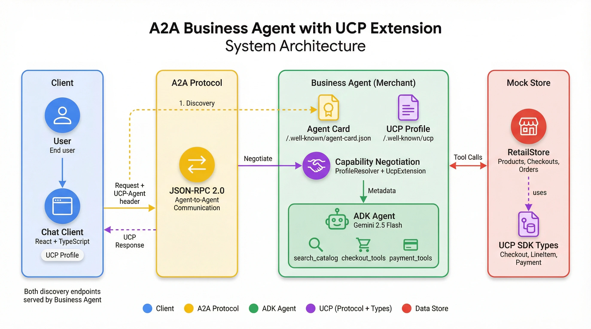

<!--
   Copyright 2026 UCP Authors

   Licensed under the Apache License, Version 2.0 (the "License");
   you may not use this file except in compliance with the License.
   You may obtain a copy of the License at

       http://www.apache.org/licenses/LICENSE-2.0

   Unless required by applicable law or agreed to in writing, software
   distributed under the License is distributed on an "AS IS" BASIS,
   WITHOUT WARRANTIES OR CONDITIONS OF ANY KIND, either express or implied.
   See the License for the specific language governing permissions and
   limitations under the License.
-->

# Ingram Micro B2B Retail Agent — UCP + A2A Demo

This sample demonstrates how to build an AI-powered **B2B shopping assistant** using the **[Universal Commerce Protocol (UCP)](https://ucp.dev)** — an open standard enabling interoperability between commerce platforms, merchants, and payment providers.

The agent is built with **[Google ADK](https://google.github.io/adk-docs/)** (Agent Development Kit), exposes itself via the **[A2A Protocol](https://google.github.io/A2A/)** (Agent-to-Agent), and is paired with a **React + TypeScript chat client** for a complete end-to-end demo.

<table>
<tr><td colspan="2" align="center"><b>Key Features</b></td></tr>
<tr><td>🛒</td><td><b>UCP Checkout:</b> Implements <code>dev.ucp.shopping.checkout</code> — line items, totals, and order creation with status lifecycle (<code>incomplete</code> → <code>ready_for_complete</code> → <code>completed</code>).</td></tr>
<tr><td>📦</td><td><b>UCP Fulfillment:</b> Implements <code>dev.ucp.shopping.fulfillment</code> — shipping address collection, delivery options, and fulfillment method selection.</td></tr>
<tr><td>💳</td><td><b>UCP Payment:</b> Supports <code>PaymentInstrument</code> types with configurable payment handlers and merchant business configuration via UCP profile.</td></tr>
<tr><td>🤝</td><td><b>Capability Negotiation:</b> Client and merchant exchange UCP profiles at <code>/.well-known/ucp</code> to agree on supported features before transactions begin.</td></tr>
<tr><td>🤖</td><td><b>Google ADK Agent:</b> Gemini-powered AI with shopping tools (product search, checkout, payment) in <code>business_agent/src/business_agent/agent.py</code>.</td></tr>
<tr><td>🏪</td><td><b>RetailStore Backend:</b> Full B2B store logic in <code>store.py</code> — product catalog, cart management, order processing, and UCP type mapping.</td></tr>
<tr><td>🔗</td><td><b>A2A Protocol:</b> Agent discovery via <code>/.well-known/agent-card.json</code> and JSON-RPC 2.0 messaging implemented in <code>agent_executor.py</code>.</td></tr>
<tr><td>💻</td><td><b>React Chat Client:</b> TypeScript UI (<code>chat-client/</code>) built with React 19 + Vite that renders UCP data types: Checkout, LineItem, PaymentResponse, OrderConfirmation.</td></tr>
</table>

## Repository Structure

```
ingrammicro.ucp.demo/
├── business_agent/               # Python backend agent
│   ├── src/business_agent/
│   │   ├── agent.py              # ADK agent definition & tools
│   │   ├── agent_executor.py     # A2A task executor & JSON-RPC handler
│   │   ├── store.py              # B2B retail store logic & UCP type mapping
│   │   ├── ucp_profile_resolver.py  # UCP capability negotiation
│   │   ├── payment_processor.py  # Payment handling
│   │   ├── main.py               # Uvicorn server entry point (port 10999)
│   │   ├── constants.py          # Shared constants
│   │   ├── models/               # Pydantic data models
│   │   ├── helpers/              # Utility helpers
│   │   ├── a2a_extensions/       # A2A protocol extensions
│   │   └── data/                 # Product catalog & mock data
│   ├── pyproject.toml            # Python project config (UV/hatchling)
│   └── .env                      # Environment variables (GOOGLE_API_KEY)
│
├── chat-client/                  # React TypeScript frontend
│   ├── App.tsx                   # Main chat application
│   ├── components/               # UI components (chat, checkout, payment)
│   ├── types.ts                  # UCP TypeScript type definitions
│   ├── config.ts                 # Client configuration
│   ├── mocks/                    # Mock payment data
│   └── package.json              # Node dependencies (React 19, Vite 6)
│
├── docs/                         # Deep-dive documentation
│   ├── 00-glossary.md
│   ├── 01-architecture.md
│   ├── 02-adk-agent.md
│   ├── 03-ucp-integration.md
│   ├── 04-commerce-flows.md
│   ├── 05-frontend.md
│   ├── 06-extending.md
│   ├── 07-testing-guide.md
│   └── 08-production-notes.md
│
├── assets/                       # Screenshots and demo assets
├── DEVELOPER_GUIDE.md            # Architecture & developer guide
├── SKILLS.md                     # AI assistant context (Claude, Gemini CLI, Cursor)
└── README.md                     # This file
```

## Demo

<p align="center">
<b>Complete Shopping Flow</b><br/>
<i>Product search → Add items to Checkout → Payment → Order confirmation</i>
<br/><br/>

<br/><br/>
<a href="https://github.com/user-attachments/assets/8d3d17f5-dbcc-4cc8-91b9-2b7d48b3f2df">▶️ Watch the full demo video</a>
</p>

## Architecture

<p align="center">
<b>System Architecture</b><br/>
<i>How the Chat Client, A2A Protocol, Business Agent, and RetailStore interact</i>
<br/><br/>

</p>

**Key points:**

- **Chat Client** sends requests with a `UCP-Agent` header containing its profile URL
- **Business Agent** serves both `/.well-known/agent-card.json` (A2A) and `/.well-known/ucp` (UCP Profile) on port `10999`
- **Capability Negotiation** happens via `ucp_profile_resolver.py` before processing each request
- **RetailStore** (`store.py`) handles all commerce logic using UCP SDK types for checkout, fulfillment, and payment

## Quick Start

> ⏱️ **Setup time:** ~5 minutes

### Prerequisites

- [ ] Python 3.10+ with [UV](https://docs.astral.sh/uv/)
- [ ] Node.js 18+
- [ ] [Gemini API Key](https://aistudio.google.com/apikey)

### 1. Start the Business Agent

```bash
cd business_agent
uv sync
cp .env.example .env   # then set GOOGLE_API_KEY in .env
uv run business_agent
```

**Expected output:**

```
INFO:     Started server process
INFO:     Uvicorn running on http://0.0.0.0:10999
```

Verify the agent is running:

- **Agent Card:** http://localhost:10999/.well-known/agent-card.json
- **UCP Profile:** http://localhost:10999/.well-known/ucp

### 2. Start the Chat Client

In a new terminal:

```bash
cd chat-client
npm install
npm run dev
```

**Expected output:**

```
VITE v6.x.x ready
➜ Local: http://localhost:3000/
```

The Chat Client UCP Profile is at: http://localhost:3000/profile/agent-profile.json

### 3. Try It Out

1. Navigate to http://localhost:3000
2. Type `"show me server racks available in stock"` and press enter
3. The agent returns matching products from the B2B catalog
4. Click **"Add to Checkout"** for any product
5. The agent asks for email address, shipping address, etc.
6. Once all details are provided, click **"Complete Payment"**
7. Select a mock payment method and click **"Confirm Purchase"**
8. The agent creates an order and returns the order confirmation

> **Note:** This sample is for demonstration purposes only. See [Production Notes](docs/08-production-notes.md) for security and deployment considerations.

## Technology Stack

| Technology | Version | Purpose |
|---|---|---|
| **[Google ADK](https://google.github.io/adk-docs/)** | `>=1.22.0` | AI agent framework, Gemini LLM, session management |
| **[UCP SDK](https://github.com/Universal-Commerce-Protocol/python-sdk)** | `0.1.0` | Standardized commerce data types |
| **[A2A Protocol](https://a2a-protocol.org/latest/)** | — | Agent discovery, JSON-RPC 2.0 messaging |
| **[Pydantic](https://docs.pydantic.dev/)** | `>=2.12.3` | Data validation and models |
| **[Uvicorn](https://www.uvicorn.org/)** | `>=0.35.0` | ASGI server for the agent |
| **[React](https://react.dev/)** | `^19.2.0` | Chat client UI |
| **[TypeScript](https://www.typescriptlang.org/)** | `~5.8.2` | Type-safe frontend |
| **[Vite](https://vitejs.dev/)** | `^6.2.0` | Frontend build tool |

## What is UCP?

**Universal Commerce Protocol (UCP)** is an open standard enabling interoperability between commerce platforms, merchants, and payment providers. This demo implements:

- `dev.ucp.shopping.checkout` — Checkout session with status: `incomplete` → `ready_for_complete` → `completed`
- `dev.ucp.shopping.fulfillment` — Shipping and delivery handling
- `dev.ucp.shopping.discount` — Discount and promotional codes

[Learn more at ucp.dev →](https://ucp.dev)

## Documentation

| Resource | Description |
|---|---|
| [DEVELOPER_GUIDE.md](DEVELOPER_GUIDE.md) | Architecture overview and developer guide |
| [01-architecture.md](docs/01-architecture.md) | System design deep-dive |
| [02-adk-agent.md](docs/02-adk-agent.md) | ADK agent implementation |
| [03-ucp-integration.md](docs/03-ucp-integration.md) | UCP integration details |
| [04-commerce-flows.md](docs/04-commerce-flows.md) | Commerce flow walkthroughs |
| [05-frontend.md](docs/05-frontend.md) | Chat client implementation |
| [06-extending.md](docs/06-extending.md) | How to extend this sample |
| [07-testing-guide.md](docs/07-testing-guide.md) | Testing strategies |
| [08-production-notes.md](docs/08-production-notes.md) | Production readiness & security |
| [SKILLS.md](SKILLS.md) | AI assistant context for Claude, Gemini CLI, Cursor, Codex |

## Related Resources

- [UCP Specification](https://ucp.dev/specification/overview/)
- [Google ADK Documentation](https://google.github.io/adk-docs/)
- [A2A Protocol Specification](https://a2a-protocol.org/latest/specification/)
- [UCP Python SDK](https://github.com/Universal-Commerce-Protocol/python-sdk)

## Disclaimer

This is an example implementation for demonstration purposes and is not intended for production use.
